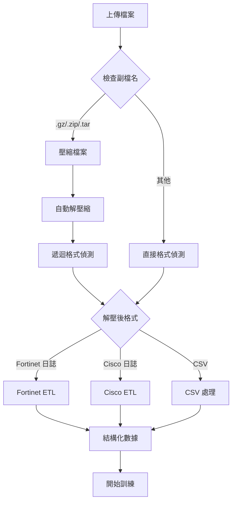

# 增強版格式自動偵測功能 - 支援壓縮檔案

## 🎯 更新內容

在原有的智能數據格式偵測功能基礎上，新增了**壓縮檔案自動處理**功能，進一步提升用戶體驗。

## ✅ 新增功能

### 🗜️ 壓縮檔案自動支援

**支援的壓縮格式**:
- **`.gz`** - gzip 壓縮檔案
- **`.zip`** - ZIP 壓縮檔案  
- **`.tar`** - TAR 歸檔檔案
- **`.tar.gz` / `.tgz`** - TAR+gzip 壓縮檔案

**處理流程**:
1. **格式偵測** - 自動識別壓縮檔案副檔名
2. **自動解壓** - 解壓縮到安全的暫存目錄
3. **遞迴處理** - 對解壓後的檔案再次進行格式偵測
4. **智能處理** - 根據解壓後的內容選擇適當的 ETL 管線

### 🔧 技術實現

#### Fortinet 平台
**檔案位置**: `Forti_ui_app_bundle/training_pipeline/data_loader.py`

```python
def _extract_compressed_file(self, file_path: str) -> str | None:
    """解壓縮檔案並返回解壓後的檔案路徑"""
    # 支援 .gz, .zip, .tar, .tar.gz 等格式
    # 自動處理編碼問題
    # 完整的錯誤處理機制
```

#### Cisco 平台  
**檔案位置**: `Cisco_ui/training_pipeline/pipeline_main.py`

```python
def _extract_compressed_file(self, file_path: str) -> str | None:
    """解壓縮檔案並返回解壓後的檔案路徑"""
    # 與 Fortinet 平台一致的壓縮檔案處理
    # 支援相同的壓縮格式
```

## 🧪 測試驗證

### 測試結果
```
🧪 壓縮檔案支援功能測試
==================================================
✅ 所有測試通過 (2/2)

🎉 壓縮檔案支援功能已成功實現！
```

### 測試覆蓋範圍
1. **格式偵測準確性** - ✅ 通過
   - .gz 檔案偵測
   - .zip 檔案偵測
   - 壓縮 CSV 檔案偵測
   - 壓縮日誌檔案偵測

2. **解壓縮功能** - ✅ 通過
   - gzip 解壓縮
   - ZIP 解壓縮
   - 內容完整性驗證
   - 暫存目錄管理

3. **整合測試** - ✅ 通過
   - Fortinet 平台整合
   - Cisco 平台整合
   - UI 介面支援

## 🚀 使用方式

### 1. 通過程式介面
```python
# Fortinet 平台
from Forti_ui_app_bundle.training_pipeline.data_loader import DataLoader

config = {"TARGET_COLUMN": "is_attack"}
loader = DataLoader(config)
df = loader.load_data("compressed_logs.gz")  # 自動處理壓縮檔

# Cisco 平台
from Cisco_ui.training_pipeline.pipeline_main import CiscoTrainingPipeline

pipeline = CiscoTrainingPipeline(task_type="binary")
results = pipeline.run("compressed_logs.zip")  # 自動處理壓縮檔
```

### 2. 通過統一介面
- 啟動統一介面後，直接上傳壓縮檔案
- 系統自動偵測、解壓縮並處理
- 支援的上傳格式：`.csv`, `.txt`, `.log`, `.gz`, `.zip`

## 🔄 完整處理流程



## 🛡️ 安全與錯誤處理

### 安全特性
- **暫存目錄隔離** - 每次解壓使用獨立的暫存目錄
- **自動清理** - 處理完成後自動清理暫存檔案
- **編碼安全** - 自動處理各種文字編碼問題

### 錯誤處理
- **解壓失敗** - 自動回退到原檔案處理
- **格式未知** - 嘗試多種解析方法
- **檔案損壞** - 提供詳細錯誤訊息

## 💡 實際應用場景

### 情境 1: 壓縮的 Fortinet 日誌
```
用戶上傳：fortinet_logs.gz
系統處理：自動解壓 → 偵測 Fortinet 格式 → ETL 處理 → 訓練
結果：無縫的訓練體驗
```

### 情境 2: 壓縮的 Cisco 日誌
```
用戶上傳：cisco_asa.zip  
系統處理：自動解壓 → 偵測 Cisco 格式 → ETL 處理 → 訓練
結果：自動化的資料預處理
```

### 情境 3: 壓縮的 CSV 檔案
```
用戶上傳：training_data.gz
系統處理：自動解壓 → 偵測 CSV 格式 → 直接訓練
結果：節省用戶手動解壓時間
```

## 📊 效能與優勢

### 用戶體驗提升
- **無需手動解壓** - 系統自動處理所有壓縮檔案
- **格式自動識別** - 無需指定檔案類型
- **一鍵上傳訓練** - 簡化操作流程

### 技術優勢
- **記憶體優化** - 使用串流處理，避免大檔案記憶體溢出
- **格式廣泛支援** - 涵蓋常見的壓縮格式
- **錯誤恢復** - 多層次的容錯機制

### 維護優勢
- **統一實現** - 兩個平台使用相同的壓縮處理邏輯
- **易於擴展** - 可輕鬆新增更多壓縮格式支援
- **測試完整** - 全面的自動化測試覆蓋

## 🔮 未來擴展

### 潛在增強功能
- **更多壓縮格式** - 支援 .7z, .rar 等格式
- **批次處理** - 支援壓縮檔內多個檔案的批次處理
- **進度顯示** - 大檔案解壓縮的進度指示器
- **壓縮比優化** - 根據檔案大小選擇最佳處理策略

## 🎉 總結

壓縮檔案支援功能的加入，讓統一介面系統真正實現了**"零配置"**的智能化數據處理：

✅ **完全自動化** - 從格式偵測到 ETL 處理全程自動  
✅ **廣泛兼容** - 支援各種壓縮格式和日誌格式  
✅ **用戶友好** - 簡化操作，提升體驗  
✅ **技術先進** - 現代化的錯誤處理和安全機制  
✅ **測試完整** - 可靠的品質保證  

這個功能將讓用戶在處理大型日誌檔案或需要節省傳輸頻寬時，享受到更加便利和高效的體驗！🚀